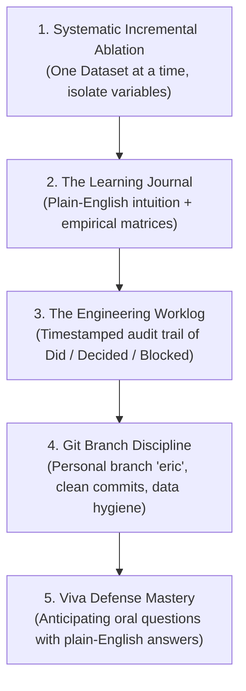

# Empirical Research & Learning Methodology Guide

**Project**: Low-Resource Language Modeling for Ewe (Èʋegbe) — ICS554 Prosit 1  
**Author**: Eric Elikplim Sunu & Antigravity  
**Target Repository**: `https://github.com/ASU-MICS-2028/nlp-group-1-prosit-1`

---

## 1. The Core Philosophy: "Explain to a Beginner, Build Like a Senior"

When working on complex mathematical, statistical, and software engineering projects, we strictly enforce a **dual-layer standard**:

1. **The Senior Engineer Layer (Code & Rigor):**
   - High test coverage, zero data leakage, clean modular code in `src/`, reproducible environments (`.venv`), strict typing, and automated formatting.
2. **The Beginner / Student Layer (Pedagogy & Defense):**
   - Every single concept, metric, and mathematical formula must first be explained in **plain, simple, beginner-friendly English** using **concrete everyday physical analogies** (e.g., bread slicers, Lego bricks, exam study guides, fruit salads).
   - Once the intuition clicks, we link it directly to the **exact technical academic terminology** required for the oral Viva Exam (`clenam.ai`). If you cannot explain *why* a number appeared on a slide to a 10-year-old, you don't truly understand it yet.

---

## 2. The 5 Pillars of Our Workflow



---

### Pillar 1: Systematic Incremental Ablation (The "One Variable at a Time" Rule)

Never dump everything into a giant black box and hope it works. When working with multiple datasets or architectures:

1. **Isolate the Source:** Take Dataset 1 completely by itself.
2. **Clean & Normalize:** Enforce character encoding (Unicode NFC), strip noise, and verify phonetic/orthographic validity.
3. **Run the Full Matrix:** Benchmark across all tokenization schemes (Whitespace, Unicode Word, Stemmer, BPE Subwords, Character) across all model orders ($N=1\dots 6$).
4. **Locate the Breaking Point:** Find the exact order where perplexity stops improving and begins degrading. Document the sparsity percentage.
5. **Repeat for Dataset 2, 3, etc.:** Observe how dataset size, linguistic domain (spoken vs. literary vs. web), and vocabulary shift the breaking point.
6. **Harmonize & Fuse:** Only after individual properties are documented do we merge datasets into a Grand Unified Corpus to quantify the empirical scaling laws!

---

### Pillar 2: The Learning Journal (`reports/LEARNING_JOURNAL.md`)

The Learning Journal is your **personal knowledge vault and study guide**. It is not just raw logs; it is a pedagogical record of your intellectual journey.

#### What Goes Into the Journal:
1. **The Mental Model / Plain-English Analogy:**
   - Example: Why does Whitespace tokenization fail? *The "Glued Punctuation" analogy: if a bread slicer glues the plastic bag to the bread crust, `bread.` and `bread!` are counted as two totally different foods!*
2. **The Empirical Results Table:**
   - Always record: Model Order ($N$), Vocabulary Size ($|V|$), Sparsity (% unseen test transitions), Laplace Perplexity, and Smoothed/Interpolated Perplexity.
3. **Qualitative Autoregressive Generation:**
   - Sample actual generated text at each order. Show how $N=1$ generates word salad, $N=3$ generates fluent natural language, and $N=6$ falls into verbatim memorization.
4. **Bugs & Real-World Quirks Discovered:**
   - Example: How Python's `str.isalnum()` falsely breaks on Ewe combining tone marks (`\u0303`), and how the regex fix resolved it.
5. **Cross-Experiment Insights:**
   - Side-by-side comparison tables explaining why one dataset behaved differently than another.

---

### Pillar 3: The Engineering Worklog (`WORKLOG.md`)

The Worklog is your **unshakeable audit trail**. In academic and professional AI work, course instructors and defense committees demand proof of authentic development and AI declaration.

#### The Mandatory Worklog Format:
Every session must append an entry to the top of `WORKLOG.md` adhering to this exact format:

```markdown
## YYYY-MM-DD · HH:MM–HH:MM GMT · [Your Name]

**Branch:** [e.g., eric]
**Assistant:** [e.g., Gemini / Antigravity], to [concise 1-sentence summary of the task].
**Did:**
- Concrete action 1 (e.g., ran ablation sweep on Dataset 3 Waxal speech).
- Concrete action 2 (e.g., fixed combining diacritic regex in `src/tokenizers.py`).
**Decided:**
- Real decisions made and their technical justification (e.g., capped unified web corpus slice at 80k sentences to preserve domain balance and prevent 99% liturgical skew).
**Blocked / open questions:**
- Genuine blockers or uncertainties (never leave blank if something was unresolved).
**Next:**
- Concrete prioritized next steps for the upcoming session.
```

---

### Pillar 4: Git Branch Discipline & Data Hygiene

1. **Branch Protection:**
   - **Never push or commit directly to `main`**. All work happens on your personal designated branch (e.g., `eric`).
   - Work is merged to `main` only via reviewed Pull Requests when deliverables are fully validated.
2. **Conventional Commits:**
   - Use descriptive prefixes:
     - `feat(...)`: New feature, tokenizer, or experiment pipeline.
     - `fix(...)`: Bug fix in regex, smoothing math, or data ingestion.
     - `docs(...)`: Updating learning journal, worklog, or technical reports.
     - `refactor(...)`: Restructuring code without changing behavior.
3. **Strict Data Hygiene:**
   - **Never commit raw data files, large `.parquet`, `.csv`, `.xlsx`, or `.txt` corpora to git.**
   - All data paths must be covered by `.gitignore`.
   - Only commit: source code (`src/`), experiment scripts (`scripts/`), reproducible JSON benchmarks (`reports/results_*.json`), figures (`figures/`), and markdown documentation.

---

### Pillar 5: Viva Exam Readiness (`clenam.ai` / Oral Defense)

At Ashesi University, the technical report and automated Viva Quiz evaluate whether you truly grasp the underlying mathematical mechanisms:

1. **Perplexity Invariance Rule:**
   - *Question:* "Can I compare the perplexity of my Character model (PPL = 7.0) with my Word model (PPL = 130.0)?"
   - *Plain Answer:* **No!** Perplexity measures the branching factor of the vocabulary. Character models choose from only ~80 characters (easy guesses), while word models choose from 25,000 words. Comparing them is like comparing apples to orchards.
2. **The Curse of Dimensionality & Sparsity:**
   - *Question:* "Why does a 6-gram model perform worse than a 3-gram model when data is limited?"
   - *Plain Answer:* **The Bias-Variance Trade-off.** A 6-gram model has very low bias (it remembers rich context), but infinite variance because $99\%$ of 6-word combinations never appeared in training. When test time comes, it starves and has to fall back to uniform guessing. A 3-gram strikes the optimal balance.
3. **Subwords as the Silver Bullet:**
   - *Question:* "How does Byte-Pair Encoding (BPE) prevent out-of-vocabulary crashes?"
   - *Plain Answer:* Instead of treating words as indivisible blocks, BPE breaks rare words into frequent character pairs (`nusrɔ̃lawo` $\to$ `nu` + `srɔ̃` + `la` + `wo`). Even if the whole word is new, the subword pieces were seen during training!

---

## 3. Quick Checklist for Every Experiment Session

- [ ] Am I on my personal branch (`git status` shows `On branch eric`)?
- [ ] Is my virtual environment active (`source .venv/bin/activate`)?
- [ ] Did I run a quick smoke test before launching a long benchmark?
- [ ] Did I log the exact results, tables, and plain-English takeaways in `reports/LEARNING_JOURNAL.md`?
- [ ] Did I record my time, assistant attribution, Did/Decided/Blocked/Next in `WORKLOG.md`?
- [ ] Are all raw data files safely excluded by `.gitignore`?
- [ ] Did I commit my changes with a clean conventional commit message?
