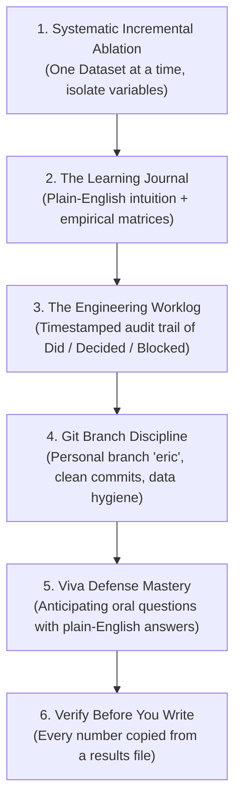

# Empirical Research & Learning Methodology Guide

**Project**: Low-Resource Language Modeling for Ewe (Èʋegbe) — ICS554 Prosit 1  
**Author**: Eric Elikplim Sunu & Antigravity  
**Target Repository**: `https://github.com/ASU-MICS-2028/nlp-group-1-prosit-1`

---

## 1. The Core Philosophy: "Explain to a Beginner, Build Like a Senior"

When working on complex mathematical, statistical, and software engineering projects, we strictly enforce a **dual-layer standard**:

1. **The Senior Engineer Layer (Code & Rigor):**
   - High test coverage, zero data leakage, clean modular code in `src/`, reproducible environments (`.venv`), strict typing, and automated formatting.
2. **The Beginner / Student Layer (Pedagogy & Defense):**
   - Every single concept, metric, and mathematical formula must first be explained in **plain, simple, beginner-friendly English** using **concrete everyday physical analogies** (e.g., bread slicers, Lego bricks, exam study guides, fruit salads).
   - Once the intuition clicks, we link it directly to the **exact technical academic terminology** required for the oral Viva Exam (`clenam.ai`). If you cannot explain *why* a number appeared on a slide to a 10-year-old, you don't truly understand it yet.

---

## 2. The 6 Pillars of Our Workflow



---

### Pillar 1: Systematic Incremental Ablation (The "One Variable at a Time" Rule)

Never dump everything into a giant black box and hope it works. When working with multiple datasets or architectures:

1. **Isolate the Source:** Take Dataset 1 completely by itself.
2. **Clean & Normalize:** Enforce character encoding (Unicode NFC), strip noise, and verify phonetic/orthographic validity.
3. **Run the Full Matrix:** Benchmark across all tokenization schemes (Whitespace, Unicode Word, Stemmer, BPE Subwords, Character) across all model orders ($N=1\dots 6$).
4. **Find Where Longer Context Stops Helping:** Record validation perplexity and sparsity for every order. With correct smoothing the curve flattens; if it turns upward, test the model (do its probabilities sum to 1?) before believing it.
5. **Repeat for Dataset 2, 3, etc.:** Observe how dataset size, linguistic domain (spoken vs. literary vs. web), and vocabulary shift where the curve flattens.
6. **Harmonize & Fuse:** Only after individual properties are documented do we merge datasets into a Grand Unified Corpus to quantify the empirical scaling laws!

---

### Pillar 2: The Learning Journal (`reports/LEARNING_JOURNAL.md`)

The Learning Journal is your **personal knowledge vault and study guide**. It is not just raw logs; it is a pedagogical record of your intellectual journey.

#### What Goes Into the Journal:
1. **The Mental Model / Plain-English Analogy:**
   - Example: Why does Whitespace tokenization fail? *The "Glued Punctuation" analogy: if a bread slicer glues the plastic bag to the bread crust, `bread.` and `bread!` are counted as two totally different foods!*
2. **The Empirical Results Table:**
   - Always record, copied from the results JSON and never retyped: model order ($N$), vocabulary size ($|V|$), OOV rate, sparsity (% unseen test n-grams), validation and test perplexity, and per-word perplexity whenever tokenizers are compared.
3. **Qualitative Autoregressive Generation:**
   - Sample text at each order with a fixed seed and write down what you actually see, especially when it is not what you expected.
4. **Bugs & Real-World Quirks Discovered:**
   - Example: Python's `\w` and `str.isalnum()` do not count combining tone marks (`\u0303`) as letters, and nasalized ɔ̃ has no precomposed code point, so NFC alone cannot rescue it; the regex has to accept the combining range.
5. **Cross-Experiment Insights:**
   - Side-by-side comparison tables explaining why one dataset behaved differently than another.

---

### Pillar 3: The Engineering Worklog (`WORKLOG.md`)

The Worklog is your **unshakeable audit trail**. In academic and professional AI work, course instructors and defense committees demand proof of authentic development and AI declaration.

#### The Mandatory Worklog Format:
Every session must append an entry to the top of `WORKLOG.md` adhering to this exact format:

```markdown
## YYYY-MM-DD · HH:MM–HH:MM GMT · [Your Name]

**Branch:** [e.g., eric]
**Assistant:** [e.g., Gemini / Antigravity], to [concise 1-sentence summary of the task].
**Did:**
- Concrete action 1 (e.g., ran ablation sweep on Dataset 3 Waxal speech).
- Concrete action 2 (e.g., fixed combining diacritic regex in `src/section_b_ngram/ewe_tokenizers.py`).
**Decided:**
- Real decisions made and their technical justification (e.g., kept the first 200k rows of Dataset 4 for continuity with earlier runs, knowing they are largely Bible text).
**Blocked / open questions:**
- Genuine blockers or uncertainties (never leave blank if something was unresolved).
**Next:**
- Concrete prioritized next steps for the upcoming session.
```

---

### Pillar 4: Git Branch Discipline & Data Hygiene

1. **Branch Protection:**
   - **Never push or commit directly to `main`**. All work happens on your personal designated branch (e.g., `eric`).
   - Work is merged to `main` only via reviewed Pull Requests when deliverables are fully validated.
2. **Conventional Commits:**
   - Use descriptive prefixes:
     - `feat(...)`: New feature, tokenizer, or experiment pipeline.
     - `fix(...)`: Bug fix in regex, smoothing math, or data ingestion.
     - `docs(...)`: Updating learning journal, worklog, or technical reports.
     - `refactor(...)`: Restructuring code without changing behavior.
3. **Strict Data Hygiene:**
   - **Never commit raw data files, large `.parquet`, `.csv`, `.xlsx`, or `.txt` corpora to git.**
   - All data paths must be covered by `.gitignore`.
   - Only commit: source code and experiment scripts (`src/`, one folder per model), result files and figures (`results/`, one folder per model), the two small LoRA adapters (`models/section_c_llm/`), and markdown documentation.

---

### Pillar 5: Viva Exam Readiness (`clenam.ai` / Oral Defense)

At Ashesi University, the technical report and automated Viva Quiz evaluate whether you truly grasp the underlying mathematical mechanisms:

1. **Compare Tokenizers Per Word, Not Per Token:**
   - *Question:* "Can I compare the perplexity of my Character model with my Word model?"
   - *Plain Answer:* **Not per token.** Perplexity is the model's effective number of choices per step: a character model picks among 227 symbols, a word model among 26,489, so the character model looks far better (3.7 vs 69.3 per token). Divide the same total log-probability by the number of *words* instead, and make every model pay for the whole text (a word model that says `<unk>` must also pay to spell the word): then characters score 447.1 per word and words 202.2.
2. **Longer Context and Sparsity:**
   - *Question:* "Why does a 6-gram model perform worse than a 3-gram model when data is limited?"
   - *Plain Answer:* **With proper smoothing it doesn't.** 80% of our test 6-grams never occur in training, but interpolated Kneser-Ney passes the probability of an unseen long context down to shorter ones, so perplexity flattens from $N=4$ (70.5 at $N=4$, 69.7 at $N=6$) instead of rising. If your curve rises, first check that your probabilities sum to 1 for an unseen context: ours didn't, and that bug was our first "breaking point".
3. **What Subwords Buy You:**
   - *Question:* "How does Byte-Pair Encoding (BPE) prevent out-of-vocabulary problems?"
   - *Plain Answer:* BPE learns frequent character sequences from the training text and splits any word into those pieces, so a word never seen in training is still made of pieces that were (0.01% of our BPE test tokens were unknown, against 1.93% for whole words). The price is longer sequences: with 150 merges our test text has 2.38 BPE tokens per word, so an $N$-gram sees fewer words of context. On our data that trade still pays: BPE is the best tokenizer per word (189.1).

---

### Pillar 6: Verify Before You Write

Written for this project after an audit (2026-09-21/22) found report numbers that no code produced, a smoothing bug that created the headline "breaking point", and test questions duplicated in training. The rule that would have prevented all three:

1. **Run first, write second.** No sentence about a result is written before the script that produces it has run.
2. **Copy numbers from files.** Every number in a report, slide or journal is copied from a results JSON written by a committed script, and `reports/claims_table.md` names that file.
3. **Test the math before a sweep.** For any smoothed model, check that $\sum_w P(w \mid h) = 1$ for a seen and an unseen context. It takes one line and would have caught the interpolation bug.
4. **Tune on validation, report test once.** The order $N$, interpolation weights and discounts are chosen on the validation split.
5. **Compare like with like.** Across tokenizers, compare per-word perplexity on the same text, never per-token perplexity.
6. **Deduplicate before splitting**, then check that no test item appears in training.
7. **Read samples for correctness, not just fluency.** A fluent answer that recommends the wrong chemical is a failure.
8. **Treat AI-drafted text as unverified** until each claim in it has been traced to code or data.

---

## 3. Quick Checklist for Every Experiment Session

- [ ] Am I on my personal branch (`git status` shows `On branch eric`)?
- [ ] Is my virtual environment active (`source .venv/bin/activate`)?
- [ ] Did I run a quick smoke test before launching a long benchmark?
- [ ] Do the unit tests pass (`python -m pytest`), including the sum-to-1 checks?
- [ ] Did I choose $N$ and every other hyperparameter on the validation split?
- [ ] Is every number I wrote today copied from a results file listed in the claims table?
- [ ] Did I log the exact results, tables, and plain-English takeaways in `reports/LEARNING_JOURNAL.md`?
- [ ] Did I record my time, assistant attribution, Did/Decided/Blocked/Next in `WORKLOG.md`?
- [ ] Are all raw data files safely excluded by `.gitignore`?
- [ ] Did I commit my changes with a clean conventional commit message?
